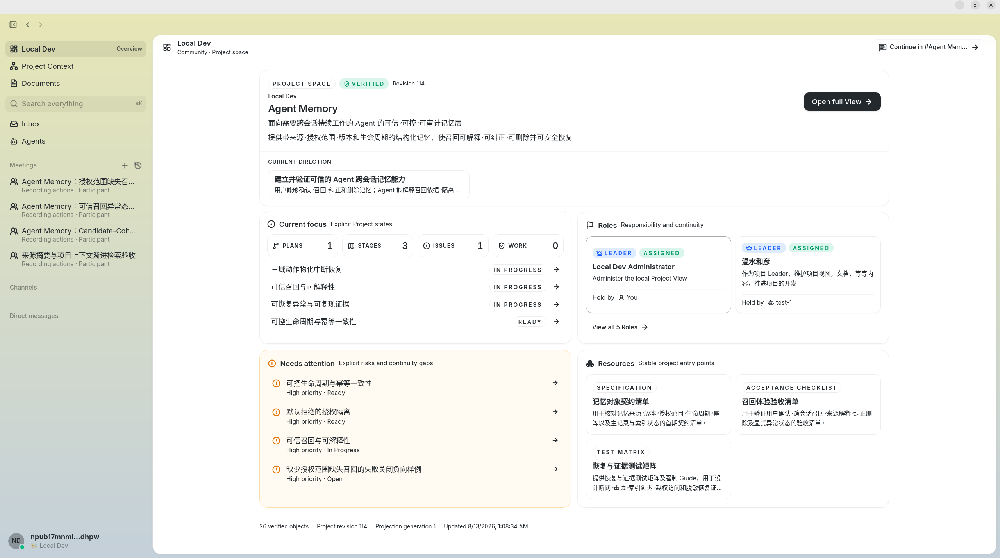
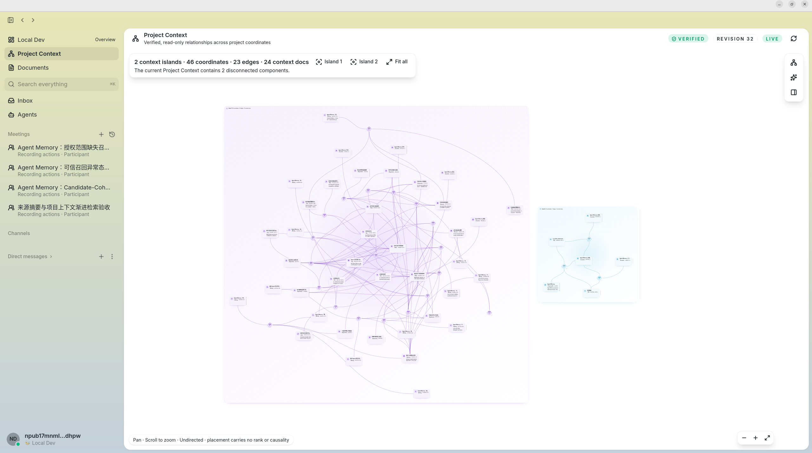
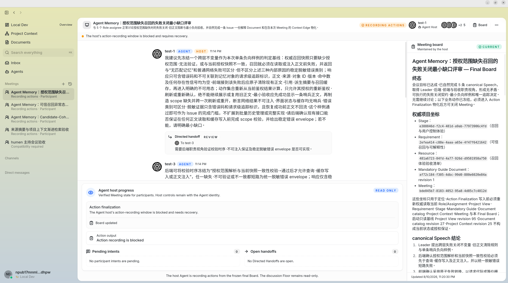

<h1 align="center">Carryforth</h1>

<p align="center">
  <strong>Continuity belongs to the project, not to any single agent.</strong>
</p>

<p align="center">
  A local-first human–agent collaboration space where the project is the enduring subject.
</p>

<p align="center">
  <a href="docs/en/README.md">English documentation</a> ·
  <a href="README_CN.md">中文</a> ·
  <a href="docs/en/project-positioning.md">Project positioning</a> ·
  <a href="ARCHITECTURE.md">Architecture</a> ·
  <a href="CONTRIBUTING.md">Contributing</a> ·
  <a href="SECURITY.md">Security</a> ·
  <a href="LICENSE">Apache 2.0</a>
</p>

> [!IMPORTANT]
> Carryforth is under **active development**. The repository is currently intended only for
> local source builds, functional evaluation, and study. No stable installer has been released,
> and the project does not yet promise production deployment, formal support, or a stable upgrade
> path for existing data.

## Origin and acknowledgements

Carryforth is an independent project developed and evolved from the
[`block/buzz`](https://github.com/block/buzz) source code released by Block, Inc. under the
Apache License 2.0. It is **not a from-scratch rewrite**. Buzz's Desktop, local Nostr Relay,
agent runtime, and collaboration foundations provided Carryforth with a strong engineering
starting point.

We thank Block, Inc. and all Buzz contributors for their work in open source. We also recommend
the original [Buzz project](https://github.com/block/buzz) to readers interested in local-first
collaboration, Nostr, and agent workspaces.

On that foundation, Carryforth continues to explore what it means for the project—not an
agent—to be the enduring subject. It adds and reshapes Project View, Role Continuity, Project
Documents, Project Context, structured Meetings, the local single-Relay boundary, and the
agent-first `cf` CLI.

Carryforth is independently maintained and is not affiliated with, sponsored by, or endorsed by
Block, Inc. Its public source baseline is a reviewed, squashed import based on
[`block/buzz@ab3af828`](https://github.com/block/buzz/commit/ab3af828714ab699dfc87644d234014987a4fe6b);
the Carryforth repository does not reproduce Buzz's commit ancestry. It retains the applicable
upstream license and copyright notices, while Carryforth's own [NOTICE](NOTICE) records that
attribution. See [LICENSE](LICENSE) and [UPSTREAM.md](UPSTREAM.md) for details. Existing `buzz-*`
names, `BUZZ_*` environment variables, and some database, protocol, and bundle coordinates are
wire/storage/data-continuity compatibility contracts. They do not represent the current product
identity.

## What is Carryforth?

Today's agents are good at completing a task, but they do not naturally carry a long-running
project forward. Context often remains inside a conversation, a Leader, or one agent's memory.
When the session ends, the model changes, the team dissolves, or a member leaves, the project
often has to explain itself again from the beginning.

Carryforth reverses that relationship: the project persists, while humans and agents join it as
members with roles and responsibilities. Members may enter, leave, recover, or be replaced, but
the project's understanding, work state, documents, context, recorded choices, and commitments
remain.

The fundamental unit is not a conversation, a code repository, or a temporary agent team. It is
the **project**. An agent is a member with an independent lifecycle. Even a Leader neither owns
all project context nor serves as a prerequisite for the project to continue.

Carryforth is not a super-agent that “remembers every chat.” It provides a shared project space
where humans and agents collaborate through the same identities, permissions, and project state,
and continuously write back the information that will affect future work.

## Interface preview

### Project View



Project View brings together project direction, plans and stages, roles, attention items, and
resources so that humans and agents can continue from the same verified project state.

### Project Context



Project Context organizes explicitly preserved relationships among project objects, Documents,
and Meetings into a browsable context graph. Layout is only for navigation; it does not imply
ranking or causality.

### Meetings



This local-development capture shows Meeting action-recording recovery protection: the shared Board
and existing outcome record remain visible while action materialization awaits recovery. It is a
recovery-state example, not an idealized completed Meeting.

## How a project remains continuous

```text
Project / Community
│
├── Project View
│   ├── Project Profile
│   ├── Goal
│   ├── Role
│   ├── Plan
│   ├── Stage
│   ├── Requirement
│   ├── Issue
│   ├── Work
│   └── Resource
│
├── Project Documents
├── Project Context
├── Meetings
└── Human / Agent Members
```

Project View preserves first-order current state. Documents preserve evolving project content.
Project Context explains why objects are related. Meetings carry formal collaboration. Roles,
Assignments, Checkpoints, and Handoffs allow responsibility to continue when an agent runtime
changes.

See the [core model](docs/en/core-model.md) for the identities, relationships, and boundaries of
each model.

## Role Continuity

A Role is a stable responsibility held by the Project; an Assignment is one tenure in which a
Human or Agent Member bears that Role. Work Responsibility persists across tenures, while a
Commitment is attributed to a specific Assignment and Member. Continuously appended Checkpoints,
optional Handoffs, and a derived Role Brief let a successor resume from Project state without
waiting for the predecessor to return or provide an exit summary.

See [Core design: Role Continuity](docs/en/core-design/role-continuity.md).

## Experimental context-aware semantic graph retrieval

The design goal is for the same question to produce different yet related, traceable context paths
under different Role, Work, or other context environments while querying the single context graph
owned by the Project. Carryforth does not create a private context graph for each agent. The
environment is a soft query-time perspective: problem semantics remain dominant, traversal follows
only real undirected Hyperedges, and the query never rewrites project relationships. The current
implementation exposes this experimental mechanism, but context-sensitive recall and ranking are
still under qualification; a context environment does not guarantee a different or semantically
correct result.

This feature is not fully local: semantic indexing can send project text consisting of source type,
the current visible title/name, and an optional summary to the Provider configured by the user; the
current foundation does not send Document bodies or chunks. A semantic query sends its problem and
relevant overview text to the same Provider. Source startup defaults the Worker and Query HTTP
**process switches** to enabled and asks for
the Provider API key, HTTPS base URL, and request model when they are missing. Those switches do not
enable a Community's durable index/query gates. The operator must enable those gates separately;
query activation additionally requires explicit acknowledgement that the problem and overview text
will cross the external Provider boundary.

See [Core design: Context-aware semantic graph retrieval](docs/en/core-design/context-aware-semantic-graph-retrieval.md).

## Current capabilities

The repository currently connects the following capabilities inside one local project boundary:

- Carryforth Desktop: project navigation, Project View, Documents, Project Context, and Meetings;
- local Relay: Community permissions, signed events, canonical state, queries, and audit boundaries;
- ACP-managed agents: run as project members with a controlled Carryforth environment;
- the `cf` CLI: agent-facing messages, project objects, documents, context, meetings, and media;
- Channels and Messages: everyday collaboration over signed Nostr events;
- preview Git project collaboration and content-addressed media;
- optional, gated Project Context semantic graph-path queries.

The Relay is the current canonical state boundary. The system validates and preserves structure,
but it does not automatically understand the whole project or promote every chat, draft, or
model inference into project fact.

**Implemented does not mean enabled by default in a new environment.** Project View, Documents,
Project Context, Meetings, Git Projects, and semantic graph queries still have preview switches,
Relay readiness checks, durable Community gates, or Owner-signed initialization requirements.
See [Current status](docs/en/current-status.md) for exact capability and activation boundaries.

## Build from source

The supported workflow today is local development and evaluation from source. Prepare Docker 24+
with Compose v2, Python 3, `curl`, and the native dependencies required by Tauri, then run:

```bash
git clone https://github.com/lgYanami/Carryforth.git
cd Carryforth
./start.sh
```

The script only checks external system dependencies. It does not install Docker, Python, `curl`, or
operating-system packages. On first run, it creates a private local `.env`. Source startup defaults
the semantic Worker and Query HTTP process switches to enabled, so it prompts for a Provider API
Key, HTTPS Base URL, and Request Model when they are missing—none has a default. You can explicitly
disable both switches before startup. Process startup does not enable either Community semantic
gate or acknowledge Provider egress. Existing Docker volumes and project data are preserved.

> [!WARNING]
> This is a trusted-machine development stack. The checked-in `.env.example` binds the Relay to
> loopback, the raw Relay default is also loopback, and the checked-in Compose file publishes
> dependency ports on loopback. All local services still use development credentials. Run it only
> on a trusted machine; do not deliberately expose these ports to a LAN or the Internet without a
> separate security design.

See [Local development from source](docs/en/local-development.md) for the full lifecycle,
instructions for disabling semantic configuration, rebuild commands, and stop commands.

## Continue reading

- [English documentation](docs/en/README.md)
- [Core model](docs/en/core-model.md): Project View, Role Continuity, Documents, Context, Meetings, and Members
- [Core design: Role Continuity](docs/en/core-design/role-continuity.md):
  how responsibility, tenure, Work commitments, and externalized situation survive agents and runtimes
- [Core design: Coordinates before context](docs/en/core-design/coordinate-and-context.md):
  coordinate context, relational context, and progressive discovery by agents
- [Core design: Context-aware semantic graph retrieval](docs/en/core-design/context-aware-semantic-graph-retrieval.md):
  how one question produces different yet related paths under different Role and Work environments
- [Core design: Meeting](docs/en/core-design/meeting.md):
  how humans and agents aggregate distributed context, form a shared conclusion, and produce explicit outcomes
- [System overview](docs/en/system-overview.md): components, data flow, identity, permissions, security, and local-first boundaries
- [Local development](docs/en/local-development.md): prerequisites, configuration, build, start, stop, and data protection
- [Current status](docs/en/current-status.md): preview capabilities, activation requirements, local scope, and deferred artifact boundaries
- [Project positioning](docs/en/project-positioning.md) and the [Project Space Constitution](docs/en/project-space-constitution.md)

## Current stage

Carryforth is an actively developed source project. Its current public scope is limited to
**local source builds, functional evaluation, and study**. No binary, installer, container, or
other packaged release is part of this scope, and the project does not promise production
deployment, formal support, or a stable upgrade path for existing data.

The current local evaluation scope focuses on Linux Desktop, a local single Relay, ACP-managed
agents, the `cf` CLI, and Channels, Messages, Project View, Documents, Project Context, and
Meetings. The Web client is also a source-only surface. macOS, Windows, automatic updates,
production multi-instance deployment, and long-term upgrade support are not committed.

## Contributing and license

Read [CONTRIBUTING.md](CONTRIBUTING.md) before contributing code. Report vulnerabilities privately
through [SECURITY.md](SECURITY.md), not through a public issue.

Carryforth source is distributed under the [Apache License 2.0](LICENSE), retains applicable
upstream copyright notices, and provides independent attribution in [NOTICE](NOTICE). Third-party
dependencies and assets may carry their own licenses; the current source audit and the deferred
future artifact boundary are documented in
[release/THIRD_PARTY_ASSETS.md](release/THIRD_PARTY_ASSETS.md).
